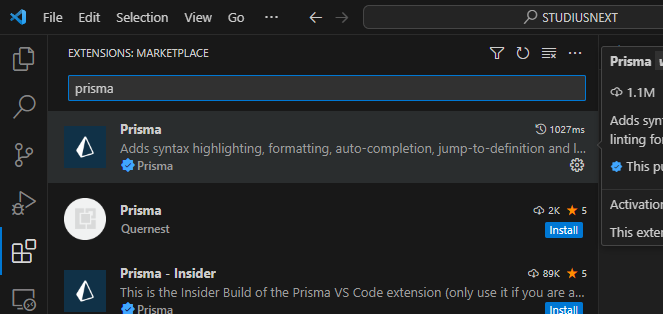
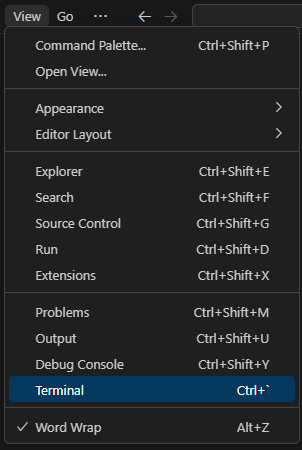
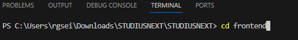
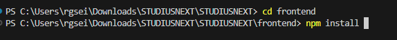
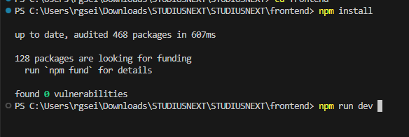
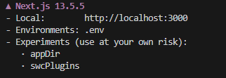
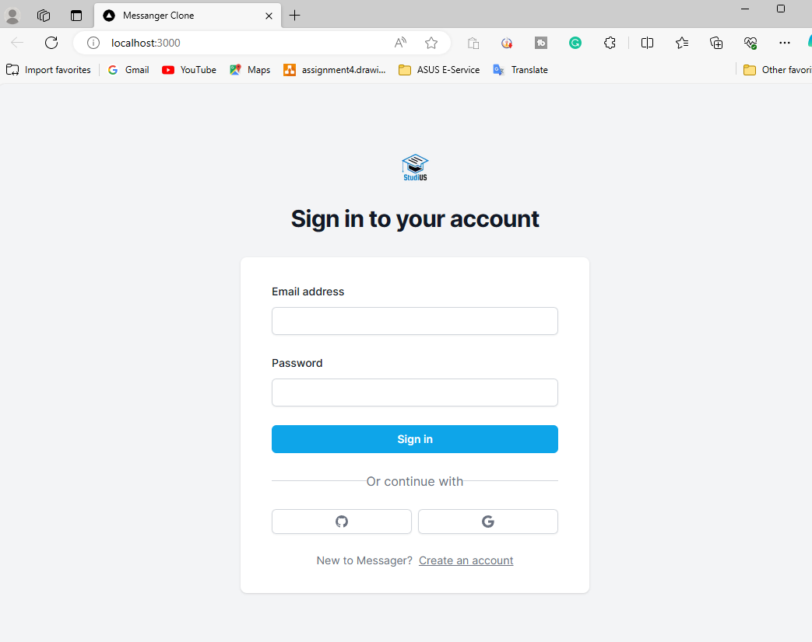

# STUDIUS

_created by Ryan, Liz, Tarek, Mindy, and Cody_

This project uses NEXT.js, Prisma, and other dependencies listed below:

## Dependencies

| Dependency | Description            |
|------------|------------------------|
| NEXT.js    | The React Framework    |
| Prisma     | Database Access        |
| axios      | For navigation         |
| ..         |..                    |

(Note: Replace '...' with other dependencies and their descriptions)

---

### 🚨 ALERT: LOOK HERE FOR INSTRUCTIONS 🚨

1. **Open Visual Studio Code**.
2. Click on `View` and then select `Terminal`.
   
   

3. In the terminal, type: `cd frontend`
This navigates to the `frontend` folder.

 

4. 🚨 MAKE SURE TO DO `npm install` 🚨 This installs all necessary packages.

5. After installation, run: `npm run dev` to run the development mode

5. Now ctrl + click on the http://localhost:3000 or manual type it in your browser

**You should get this page**

